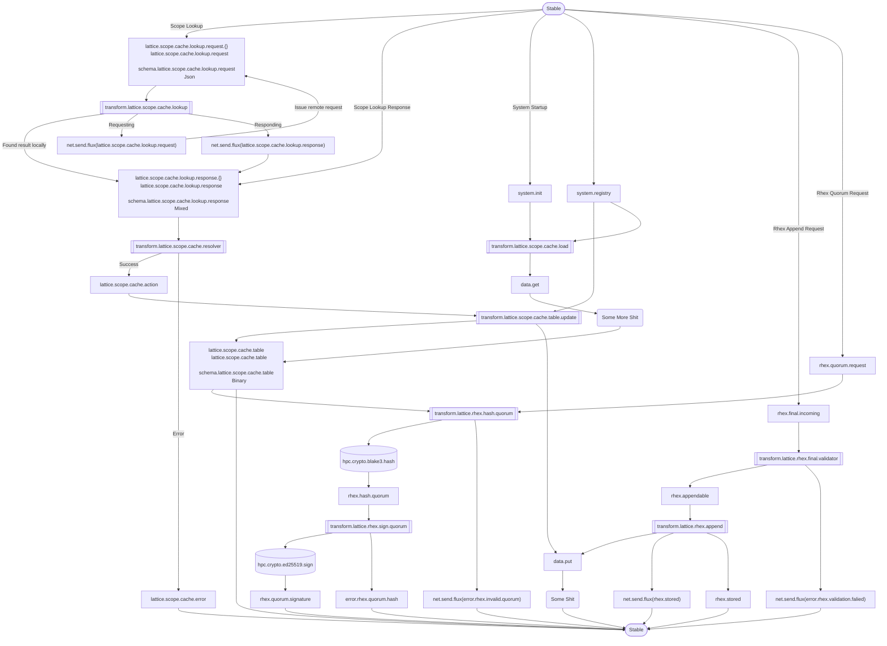
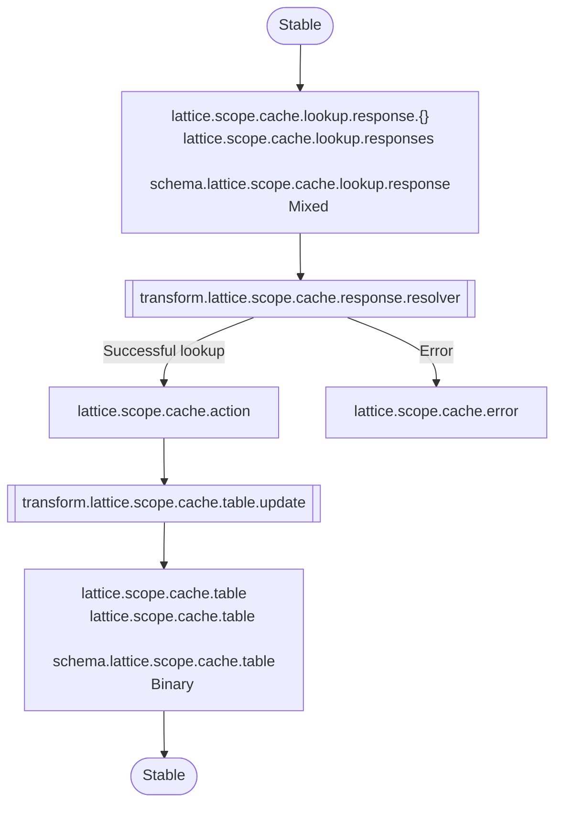
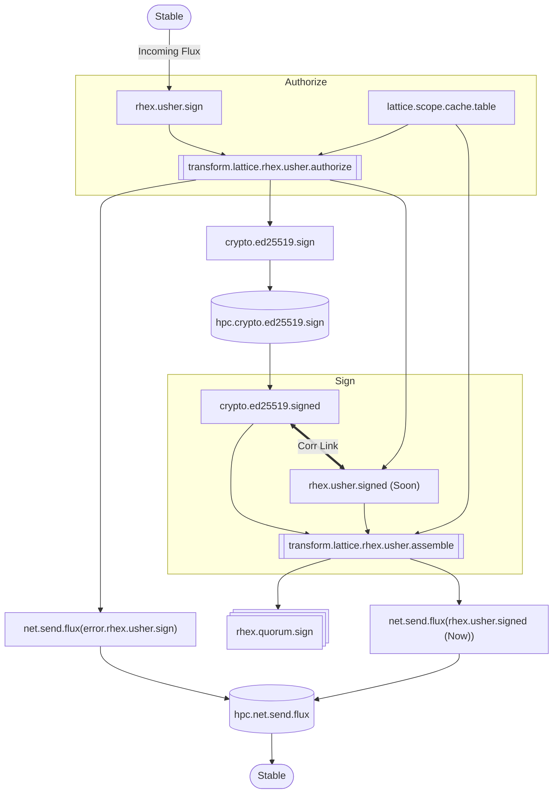
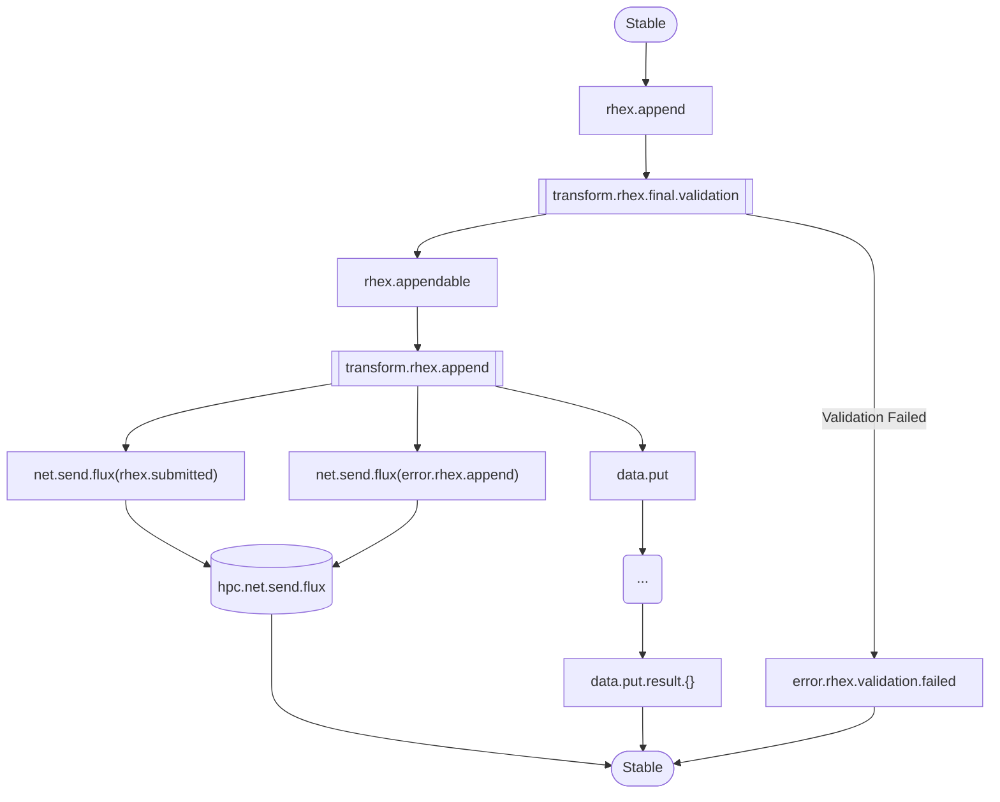

# Lattice Operations

## Overview



## Updating the cache

```json
{
    "scope": "...",
    "status": "found" | "parent" | "error",
    "slot0": "Table Entry"
}
```



## Rhex Usher Submission



## Rhex Final Submission


