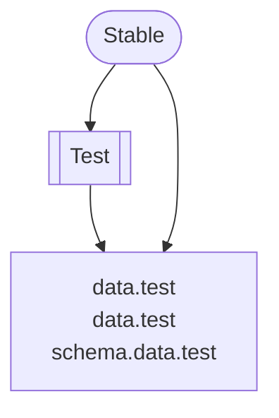

# Remote Requests

## Action in the CRE

Since action in the CRE is just computation over state, remote requests are just submitting more state to the current pond. This allows the remote requests to appear directly as a flux item. Common flux types to be pushed across:

- **lattice.scope.remote.lookup.request**
- **lattice.scope.remote.lookup.response**

## Steps

- **transform.lattice.scope.cache.lookup** -> net.send.flux(lattice.scope.cache.lookup.request)
- net.recv.flux(lattice.scope.cache.lookup.request) -> **transform.lattice.scope.cache.lookup.reponder** -> net.send.flux(lattice.scope.cache.lookup.request)

- lattice.scope.cache.lookup.request + &lattice.scope.cache.table -> transform.lattice.scope.cache.lookup -> net.send.flux(lattice.scope.remote.lookup.request)
- lattice.scope.remote.lookup.request + &lattice.scope.cache.table -> transform.lattice.scope.remote.lookup.responder -> net.send.flux(lattice.scope.remote.lookup.response)
- lattice.scope.remote.lookup.response (from net) -> transform.lattice.scope.cache.resolver -> lattice.scope.cache.lookup.result
- lattice.scope.cache.lookup.result

